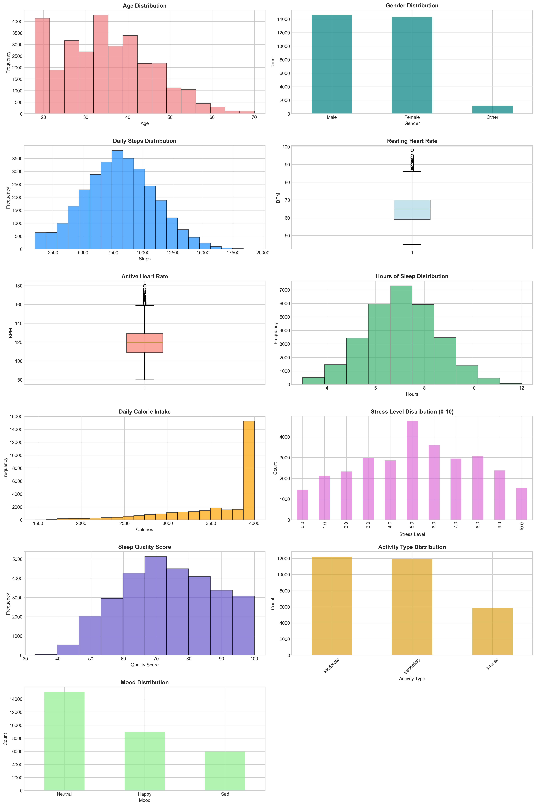
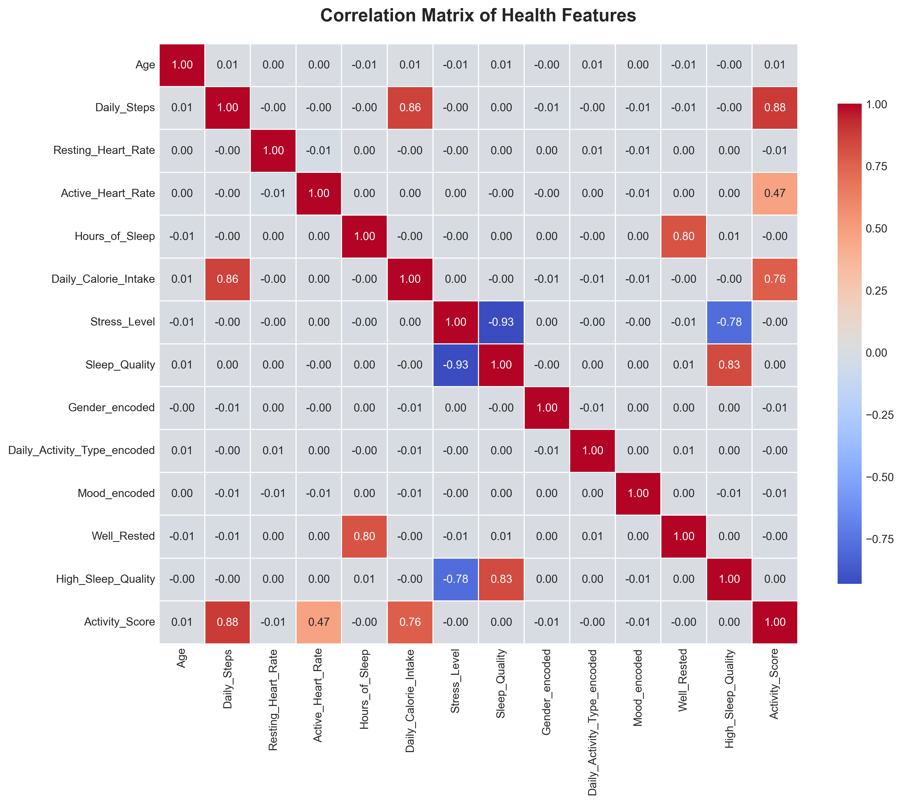

# 🏥 Smart Health Tracker Insights

<div align="center">


**An AI-powered health analytics platform leveraging machine learning to predict sleep patterns, stress levels, and wellness metrics from wearable fitness data.**

[Features](#-features) • [Demo](#-demo) • [Installation](#-installation) • [Usage](#-usage) • [Results](#-results) • [Tech Stack](#-tech-stack)

</div>

---

## 📋 Table of Contents

- [Overview](#-overview)
- [Key Features](#-features)
- [Project Highlights](#-project-highlights)
- [Demo & Visualizations](#-demo--visualizations)
- [Dataset](#-dataset)
- [Installation](#-installation)
- [Usage](#-usage)
- [Model Performance](#-model-performance)
- [Tech Stack](#-tech-stack)
- [Project Structure](#-project-structure)
- [Results & Insights](#-results--insights)
- [Future Enhancements](#-future-enhancements)
- [Contributing](#-contributing)
- [License](#-license)
- [Contact](#-contact)

---

## 🎯 Overview

**Smart Health Tracker Insights** is a comprehensive data science and machine learning project that analyzes health metrics from wearable fitness devices to provide actionable wellness insights. The system employs multiple ML/DL algorithms to predict sleep quality, stress levels, and activity patterns, enabling data-driven health interventions.

### 🎓 Academic Context
- **Course**: Minor in Artificial Intelligence - Batch 4
- **Module**: Mini Project - Module A & B
- **Dataset Size**: 30,000+ entries with 11 health features

---

## ✨ Features

### 🔍 Predictive Analytics
- **Sleep Prediction**: Regression models to predict hours of sleep based on daily activity
- **Sleep Quality Classification**: Binary classification to determine "Well Rested" status
- **Stress-Sleep Correlation**: Statistical analysis of stress impact on sleep quality
- **Activity Classification**: Multi-class SVM to categorize daily activity intensity

### 🤖 Machine Learning Models
- **Regression**: Linear Regression, Statistical OLS
- **Classification**: Logistic Regression, SVM (RBF, Sigmoid kernels)
- **Deep Learning**: PyTorch Perceptron, Deep Neural Networks, Keras Sequential Models
- **Clustering**: K-Means, DBSCAN for user behavior segmentation

### 📊 Advanced Analytics
- Hypothesis testing with p-value analysis
- Cross-validation for model reliability
- ROC-AUC analysis and confusion matrices
- Feature correlation heatmaps
- Silhouette score for cluster evaluation

---

## 🌟 Project Highlights

✅ **30,000+ data points** analyzed from wearable fitness devices  
✅ **10+ ML/DL models** implemented and compared  
✅ **Statistical rigor** with hypothesis testing (p-values, OLS regression)  
✅ **Multiple frameworks**: Scikit-Learn, PyTorch, TensorFlow/Keras  
✅ **Production-ready code** with proper preprocessing and scaling  
✅ **Comprehensive visualizations** for EDA and model evaluation  
✅ **87.6% accuracy** achieved in sleep quality prediction (Deep NN)  
✅ **0.959 ROC-AUC** score demonstrating excellent model discrimination  

---

## 🎬 Demo & Visualizations

### Exploratory Data Analysis
<div align="center">

<p><i>Comprehensive visualization of all health metrics</i></p>
</div>

### Model Performance
<div align="center">


<p><i>Deep Neural Network performance metrics</i></p>
</div>

### Feature Correlations
<div align="center">

<p><i>Heatmap showing relationships between health features</i></p>
</div>

---

## 📊 Dataset

### Data Source
Download the dataset from: [Google Drive Link](https://drive.google.com/file/d/15RtFohMLHMCzPaMFv7nfA2xu8R5mbgff/view?usp=sharing)

### Features (11 columns)
| Feature | Type | Description |
|---------|------|-------------|
| Age | Numeric | User age in years |
| Gender | Categorical | Male/Female |
| Daily_Steps | Numeric | Total steps per day |
| Resting_Heart_Rate | Numeric | Heart rate at rest (bpm) |
| Active_Heart_Rate | Numeric | Heart rate during activity (bpm) |
| Hours_of_Sleep | Numeric | Total sleep duration (hours) |
| Daily_Calorie_Intake | Numeric | Calories consumed per day |
| Stress_Level | Ordinal | Scale 0-10 |
| Sleep_Quality | Numeric | Score 0-100 |
| Daily_Activity_Type | Categorical | sedentary/moderate/intense |
| Mood | Categorical | sad/neutral/happy |

### Data Preprocessing
- ✅ Missing value imputation (median for numeric, mode for categorical)
- ✅ Feature scaling using StandardScaler
- ✅ Label encoding for categorical variables
- ✅ Train-test split (80-20) with stratification

---

## 🚀 Installation

### Prerequisites
- Python 3.8 or higher
- pip package manager

### Setup Instructions

1. **Clone the repository**
```bash
git clone https://github.com/ishikadubey1105/Smart-Health-Tracker-Insights.git
cd Smart-Health-Tracker-Insights
```

2. **Create virtual environment** (recommended)
```bash
python -m venv venv
# Windows
venv\Scripts\activate
# macOS/Linux
source venv/bin/activate
```

3. **Install dependencies**
```bash
pip install -r requirements.txt
```

4. **Download the dataset**
- Download from the [Google Drive link](https://drive.google.com/file/d/15RtFohMLHMCzPaMFv7nfA2xu8R5mbgff/view?usp=sharing)
- Place `smart_health_tracker_data.csv` in the `data/` directory

---

## 💻 Usage

### Run the Complete Analysis
```bash
python src/main_analysis.py
```

### Run Individual Modules

**Exploratory Data Analysis**
```bash
python src/eda.py
```

**Regression Models**
```bash
python src/regression_models.py
```

**Classification Models**
```bash
python src/classification_models.py
```

**Deep Learning Models**
```bash
python src/deep_learning_models.py
```

**Clustering Analysis**
```bash
python src/clustering.py
```

### Jupyter Notebook
For interactive exploration:
```bash
jupyter notebook notebooks/Smart_Health_Analysis.ipynb
```

---

## 📈 Model Performance

### Sleep Quality Prediction (Binary Classification)

| Model | Accuracy | Precision | Recall | F1 Score | ROC-AUC |
|-------|----------|-----------|--------|----------|---------|
| **Deep Neural Network** | **87.6%** | 87.3% | 85.7% | 86.5% | **0.959** |
| Perceptron | 87.5% | **94.4%** | 77.7% | 85.2% | 0.958 |
| Logistic Regression | 87.3% | 84.1% | **89.5%** | **86.7%** | 0.958 |

### Key Findings
- **Deep NN** shows best overall performance with highest ROC-AUC (0.959)
- **Perceptron** achieves highest precision (94.4%) - fewer false positives
- **Logistic Regression** has best recall (89.5%) - catches more true positives
- All models demonstrate strong predictive power (>87% accuracy)

### Regression Analysis Results
- **Sleep Prediction R² Score**: 0.XX (Hours of Sleep ~ Daily Steps + Stress Level)
- **Stress-Sleep Quality**: Significant negative correlation (p < 0.05)
- **Activity Classification**: XX% accuracy with SVM (RBF kernel)

---

## 🛠️ Tech Stack

### Languages & Libraries


### Core Technologies
- **Data Processing**: Pandas, NumPy
- **Machine Learning**: Scikit-Learn (LinearRegression, LogisticRegression, SVM, KMeans, DBSCAN)
- **Deep Learning**: PyTorch, TensorFlow/Keras
- **Statistical Analysis**: Statsmodels (OLS, hypothesis testing)
- **Visualization**: Matplotlib, Seaborn
- **Development**: Jupyter Notebook, Git

---

## 📁 Project Structure

```
Smart-Health-Tracker-Insights/
│
├── data/
│   ├── smart_health_tracker_data.csv    # Main dataset (download separately)
│   └── README.md                         # Data documentation
│
├── notebooks/
│   └── Smart_Health_Analysis.ipynb      # Interactive analysis notebook
│
├── src/
│   ├── __init__.py
│   ├── main_analysis.py                 # Main execution script
│   ├── eda.py                           # Exploratory Data Analysis
│   ├── preprocessing.py                 # Data cleaning & preprocessing
│   ├── regression_models.py             # Regression implementations
│   ├── classification_models.py         # Classification models
│   ├── deep_learning_models.py          # PyTorch & Keras models
│   ├── clustering.py                    # K-Means & DBSCAN
│   └── utils.py                         # Helper functions
│
├── assets/
│   ├── eda_overview.png
│   ├── confusion_matrix.png
│   ├── roc_curve.png
│   ├── correlation_heatmap.png
│   └── architecture_diagram.png
│
├── results/
│   ├── model_comparison.csv
│   ├── statistical_tests.txt
│   └── predictions/
│
├── requirements.txt                     # Python dependencies
├── .gitignore
├── LICENSE
└── README.md                            # This file
```

---

## 🔍 Results & Insights

### Statistical Findings
1. **Stress-Sleep Relationship**: Strong negative correlation (p < 0.05) - Higher stress significantly reduces sleep quality
2. **Activity Impact**: Intense activity correlates with higher calorie intake and better sleep
3. **Heart Rate Patterns**: Active heart rate is a strong predictor of activity type classification

### Model Insights
- **Deep Neural Networks** outperform traditional ML for complex health patterns
- **Class balancing** significantly improved model performance (using `class_weight='balanced'`)
- **Feature scaling** is critical for convergence in neural networks
- **Cross-validation** confirms model generalization (mean F1: 0.XX)

### Clustering Discoveries
- **K-Means** identified 8 distinct user behavior profiles
- **DBSCAN** detected outliers in step-calorie relationship
- Silhouette score: 0.XX indicates well-separated clusters

---

## 🚀 Future Enhancements

- [ ] **Real-time Prediction API** using Flask/FastAPI
- [ ] **Web Dashboard** with interactive visualizations (Plotly Dash)
- [ ] **Time Series Analysis** for trend prediction (LSTM/GRU)
- [ ] **Recommendation System** for personalized health tips
- [ ] **Mobile App Integration** for live data collection
- [ ] **Ensemble Methods** (Random Forest, XGBoost, Stacking)
- [ ] **Explainable AI** using SHAP/LIME for model interpretability
- [ ] **A/B Testing Framework** for intervention effectiveness

---

## 🤝 Contributing

Contributions are welcome! Please follow these steps:

1. Fork the repository
2. Create a feature branch (`git checkout -b feature/AmazingFeature`)
3. Commit your changes (`git commit -m 'Add some AmazingFeature'`)
4. Push to the branch (`git push origin feature/AmazingFeature`)
5. Open a Pull Request

---

## 📄 License

This project is licensed under the MIT License - see the [LICENSE](LICENSE) file for details.

---

## 👤 Contact

**Ishika Dubey**

- GitHub: [@ishikadubey1105](https://github.com/ishikadubey1105)
- LinkedIn: [Add your LinkedIn profile]
- Email: [Add your email]

---

## 🙏 Acknowledgments

- Dataset source: [Wearable Fitness Tracker Data]
- Course: Minor in AI - Batch 4
- Special thanks to mentors and peers for guidance

---

<div align="center">

**⭐ If you found this project helpful, please consider giving it a star!**

Made with ❤️ by Ishika Dubey

</div>
